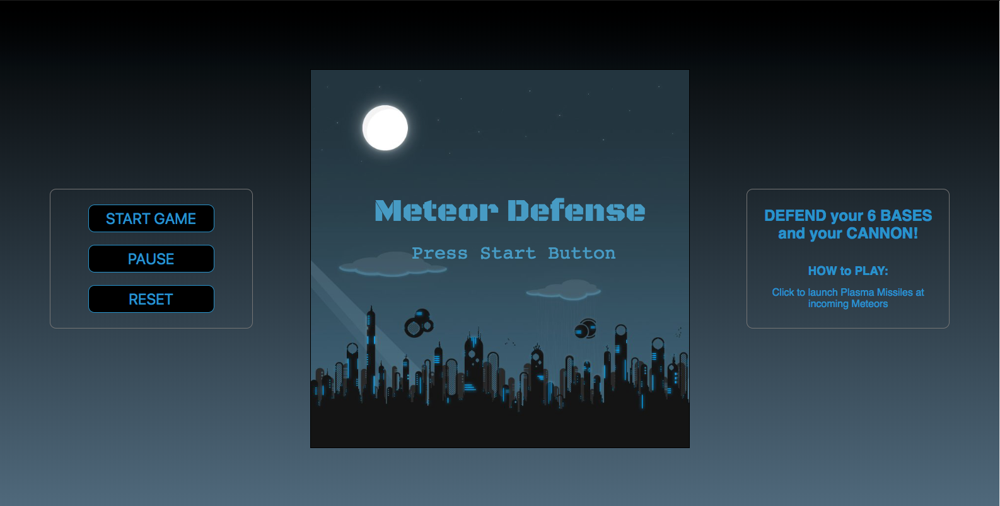

# Meteor Defense

 

 

Meteor Defense is a game which was inspired by Atari's classic Missile Command. 

This project exhibits object oriented programing, html canvas and unit testing. This was one of my earlier projects completed with a partner just 8 weeks into learning to program. We had fun making this project and learned a great deal.  

This was our first project using many separate scripts rather than one very long script, causing us to learn and think about scope and the concept of `this` in JavaScript.

### A live version of this project is deployed [here](http://meteor-defense.surge.sh/). Go play the game!

 

 

## Libraries Utilized

* HTML Canvas 
* Mocha
* Chai

## Playing the Game

### Click the start button

Defend your cannon and bases from incoming meteors. Once your cannon or all bases are destroyed the game is over. The number of remaining bases is displayed in the top right corner of the canvas.   

 

### Click on the the canvas to launch missiles

Use your missiles to defend your bases and stop incoming meteors. Try and create explosions ahead of the incoming missiles. You have 20 missiles to start. You will receive 5 more missiles on round 2 and 10 more missiles each round thereafter. The number of remaining missiles is displayed in the top center of the canvas.

 

### Waves

There are multiple waves of increasing difficulty. A wave is completed when all of the incoming meteors are destroyed. The background will change and you will hear the next level announced. The number of incoming meteors will increase with each wave. The current wave is displayed in the top left corner of the canvas.

   

### Scoring 

Gain 100 points for each meteor destroyed. Your current score is displayed in the top left corner of the canvas and at the end of the game.

 

## Installing Locally 

#### Clone down this repository. 

`git clone https://github.com/PreciseSlice/meteor-defence`

#### cd into the repository and install dependancies 

`cd swapi-box`

`npm install`

#### To start the server 

`npm start`

#### To run the test suite

`npm test`
